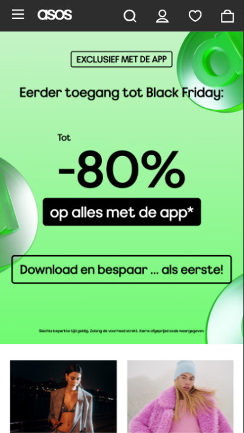
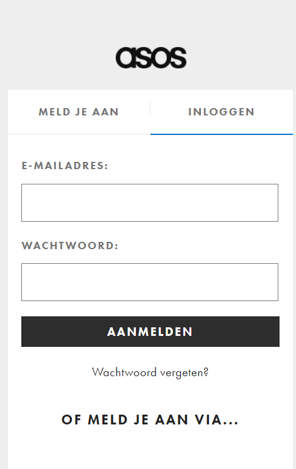

# Procesverslag
Markdown is een simpele manier om HTML te schrijven.  
Markdown cheat cheet: [Hulp bij het schrijven van Markdown](https://github.com/adam-p/markdown-here/wiki/Markdown-Cheatsheet).

Nb. De standaardstructuur en de spartaanse opmaak van de README.md zijn helemaal prima. Het gaat om de inhoud van je procesverslag. Besteedt de tijd voor pracht en praal aan je website.

Nb. Door *open* toe te voegen aan een *details* element kun je deze standaard open zetten. Fijn om dat steeds voor de relevante stuk(ken) te doen.

## Jij

  
uitwerken voor kick-off werkgroep

  ### Auteur:
  Beyzanur Arslan

  #### Je startniveau:
  hier je startniveau (blauw)

  #### Je focus:
  hier je focus (kies uit responsive óf surface plane)
 

## Je website

  
uitwerken voor kick-off werkgroep

  ### Je opdracht:
  https://www.asos.com/nl/dames/?affid=12491&_CjwKCAiAjfyqBhAsEiwA-UdzJOySPJRVg2DA79x4Wly5BVnVJVzrYKau6tYzAMgiZS98KMa1s4dDYRoC6PIQAvD_BwE&channelref=paid+search&ppcadref=11533451174%7C111330626526%7Ckwd-6719232088&gad_source=1&gclid=CjwKCAiAjfyqBhAsEiwA-UdzJOySPJRVg2DA79x4Wly5BVnVJVzrYKau6tYzAMgiZS98KMa1s4dDYRoC6PIQAvD_BwE&gclsrc=aw.ds

  #### Screenshot(s) van de eerste pagina (small screen): 
  asos blackfriday page(home pagina)
  

  #### Screenshot(s) van de tweede pagina (small screen):
  Asos inloggen page
  
 

## Toegankelijkheidstest 1/2 (week 1)

  
uitwerken na test in 2e werkgroep

  ### Bevindingen
  Lijst met je bevindingen die in de test naar voren kwamen:

## Breakdownschets (week 1)

  
uitwerken na afloop 3e werkgroep

  ### de hele pagina: 
  

  ### dynamisch deel (bijv menu): 
  

  ### wellicht nog een dynamisch deel (bijv filter): 
  

## Voortgang 1 (week 2)

  
uitwerken voor 1e voortgang

  ### Stand van zaken
  hier dit ging goed & dit was lastig (neem ook screenshots op van delen van je website en code)

  ### Agenda voor meeting
  samen met je groepje opstellen

  | student 1      | student 2          | student 3    | student 4        |
  | Ruby           | Nickolas           | Daniel       | Beyzanur         |
  | dit bespreken  | en dit             | en ik dit    | en dan ik dat    |
  | en dat ook nog | dit als er tijd is | nog een punt | dit wil ik zeker |
  | ...            | ...                | ...          | ...              |

  ### Verslag van meeting
  hier na afloop snel de uitkomsten van de meeting vastleggen

 Ik wilde een video toevoegen aan mijn website. Dat heb ik gevraagd tijdens het gesprek. De docent had een website aanbevolen die ik kan 
 gebruiken om videos toe te voegen. Ik wilde eigenlijk een video toevoegen die niet automatisch begint

## Voortgang 2 (week 3)

  
uitwerken voor 2e voortgang

  ### Stand van zaken
  hier dit ging goed & dit was lastig (neem ook screenshots op van delen van je website en code)

  ### Agenda voor meeting
  samen met je groepje opstellen

  | student 1      | student 2          | student 3    | student 4        |
  | Ruby           | Nickolas           | Daniel       | Beyzanur         |
  | dit bespreken  | background-size:   | en ik dit    | ik heb een paar vragen over menu  |
  | en dat ook nog | cover; maar hoe | nog een punt |                  |
  | ...            | ...                | ...          | ...              |

  ### Verslag van meeting
  hier na afloop snel de uitkomsten van de meeting vastleggen

  - Ik wilde een hamburgermenu maken, maar op de originele website hebben ze een div gebruikt. Dat kan ik niet, dus heb ik aan de student assistent gevraagd hoe ik mijn hamburgermenu semantisch correct kan maken. We hebben gezien dat ik twee keer het nav element mag gebruiken.
  - Ik had 4 icontjes voor de nav bijv. zoekbalk, haartjes, winkelwagen maar de icoontjes was niet hetzelfde voormaat daarvoor hadden wij een
  oplossing gevonden. Ik had de link van de iconen van orijinele website gekoppierd. sommige dingen hebben we verwijderd van de code dan lukte het wel.

## Toegankelijkheidstest 2/2 (week 4)

  
uitwerken na test in 9e werkgroep

  ### Bevindingen
  Ik had nog geen idee welke pagina als tweede  wilde ik maken. Tijdens de werkgroep hebben we met een student assistent gekeken naar de website die bij mij past en hoe ik die website kan verbeteren. Ik heb gekozen voor de cadeaubonpagina en ben daarom begonnen met html. Maar ik ben nog niet zo ver voor de tweede website.
  we hebben ook met student asistent gekijken naar voorhome page. Ik wilde asos website maken toen blackfriday is dus is de website een 
  beetje veranderd. Ik hoop da

## Voortgang 3 (week 4)

  
uitwerken voor 3e voortgang

  ### Stand van zaken
  Het ging afgelopen week goed met hamburgermenu maken. Voor de werkgroep werkte mijn javascript niet daarom was ik onder stress.
  Maar het is woensdag opgelost. 
  mijn vraag is voor deze week:ik heb een hamburgermenu met allemaal plaatjes. Hoe kan ik de tekst  aan die plaatjes toevoegen?

  ### Agenda voor meeting
  samen met je groepje opstellen

  | student 1      | student 2          | student 3    | student 4        |
  | Ruby           | Nickolas           | Daniel       | Beyzanur         |
  | dit bespreken  |hij heeft voor  deze| en ik dit    | ik heb een hamburgermenu met   |
  | en dat ook nog |week geen vragen    |              |allemaal plaatjes. Hoe kan ik de tekst     |
  | ...            | ...                | ...          |aan die plaatjes toevoegen?      |

  ### Verslag van meeting
  hier na afloop snel de uitkomsten van de meeting vastleggen

  - punt 1
  - punt 2
  - nog een punt
  - ...

## Eindgesprek (week 5)

  
uitwerken voor eindgesprek

  ### Je uitkomst - karakteristiek screenshots:
  

  ### Dit ging goed/Heb ik geleerd: 
  Korte omschrijving met plaatjes

  

  ### Dit was lastig/Is niet gelukt:
  Korte omschrijving met plaatjes

  

## Bronnenlijst

  
continu bijhouden terwijl je werkt

  Nb. Wees specifiek ('css-tricks' als bron is bijv. niet specifiek genoeg). 
  Nb. ChatGpT en andere AI horen er ook bij.
  Nb. Vermeld de bronnen ook in je code.

  1. bron 1
  2. bron 2
  3. ...

